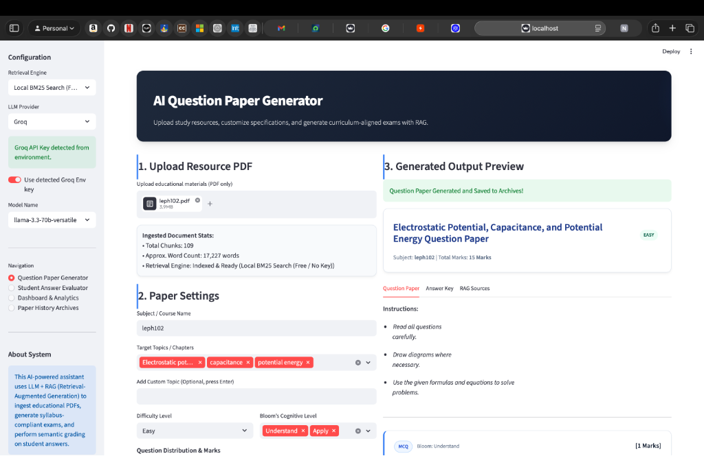

# AI Question Paper Generator & Evaluator

A professional, curriculum-aligned exam generation and semantic grading platform. This system leverages Large Language Models (LLMs) and Retrieval-Augmented Generation (RAG) to ingest study resources, generate tailored examination materials, evaluate student submissions, and provide actionable analytics for teachers.



---

## Key Features

### 1. Document Ingestion & Parsing
* Parse curriculum files, textbooks, or notes from PDF documents.
* Automatically split texts into semantically cohesive chunks for precise context retrieval.
* Use LLM acceleration to automatically extract core topics and keywords from the ingested document.

### 2. Hybrid Retrieval Engine
* **Semantic Search (FAISS)**: Leverage OpenAI vector embeddings to perform semantic-based contextual search across study resources.
* **Lexical Search (BM25)**: A free, local keyword-matching retrieval engine requiring no API keys.

### 3. Customizable Exam Generator
* Generate multiple question formats: Multiple Choice Questions (MCQ), Short Answer (SA), and Long Answer (LA).
* Customize specifications: select targeted topics, define Bloom's Taxonomy cognitive levels, set total marks, and specify question counts.
* Tailor output using custom instructions (e.g., focus on particular chapters, include numerical problems, etc.).

### 4. Interactive Student Answer Evaluator
* Grade student answer sheets using semantic evaluation.
* Compares student answers against generated key guidelines, awarding marks, percentage scores, letter grades, and actionable qualitative feedback.
* Supports autofilling answers (Good, Medium, Poor) for demonstration and testing purposes.

### 5. Analytics Dashboard & Reports
* Monitor teaching outcomes and overall student performance.
* Visualize subject-wise average scores, grade distributions, and resource utilization using interactive Plotly charts.
* Export publication-quality PDFs of generated question papers, answer keys, and student evaluation reports.

---

## Tech Stack
* **Frontend/UI**: [Streamlit](https://streamlit.io/)
* **Orchestration**: [LangChain](https://www.langchain.com/)
* **Vector Database & Search**: FAISS, Rank-BM25
* **LLM Integration**: OpenAI (GPT-4o, GPT-4o-mini) & Groq (Llama 3.3, Llama 3.1)
* **Visualizations**: Plotly
* **Export Utilities**: ReportLab (PDF Generation)

---

## Folder Structure

```text
├── app.py                  # Main Streamlit application interface
├── pdf_parser.py           # PDF extraction, chunking, and topic extraction
├── vector_store.py         # FAISS and BM25 index management
├── generation_engine.py    # RAG exam generator logic
├── answer_evaluator.py     # AI-based grading and feedback module
├── history_manager.py      # JSON-backed persistence layer for exams and grades
├── exporter.py             # PDF generator utilizing ReportLab
├── requirements.txt        # Project dependencies
└── .gitignore              # Ignored files (e.g., venv, secrets)
```

---

## Setup and Installation

### Prerequisites
* Python 3.10 or higher
* Pip (Python package installer)

### 1. Clone the Repository
```bash
git clone https://github.com/SURYANSH67/ai_question_generator.git
cd ai_question_generator
```

### 2. Set Up Virtual Environment
Create and activate a virtual environment to keep dependencies isolated:

```bash
# macOS/Linux
python3 -m venv venv
source venv/bin/activate

# Windows
python -m venv venv
venv\Scripts\activate
```

### 3. Install Dependencies
Install all required packages:
```bash
pip install -r requirements.txt
```

### 4. Environment Configuration
Create a `.env` file in the root directory:
```bash
touch .env
```

Add your API credentials:
```env
OPENAI_API_KEY=your_openai_api_key_here
GROQ_API_KEY=your_groq_api_key_here
```

*Note: If you run using the **Local BM25 Search** engine and the **Groq** LLM Provider, you only need to supply the `GROQ_API_KEY`.*

### 5. Run the Application
Start the Streamlit server:
```bash
streamlit run app.py
```

The application will launch in your default web browser at `http://localhost:8501`.

---

## License
Distributed under the MIT License. See `LICENSE` for more information.
